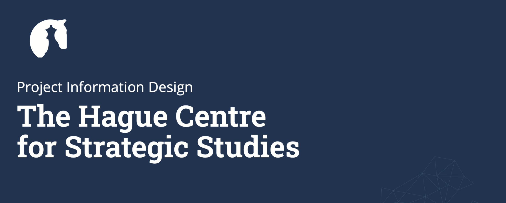
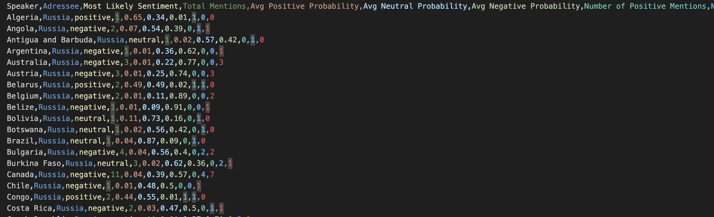
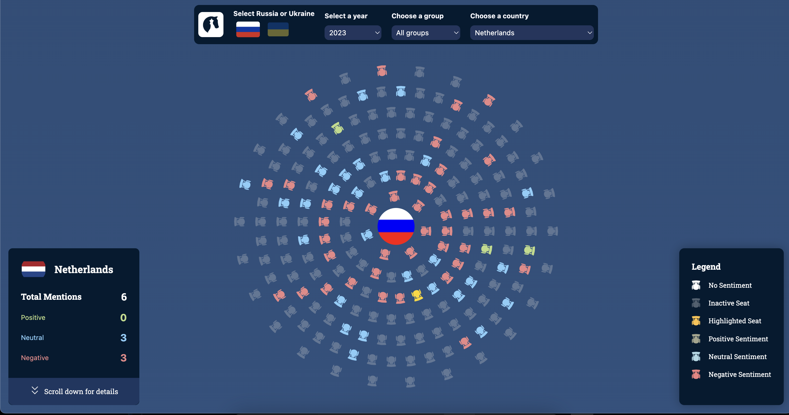
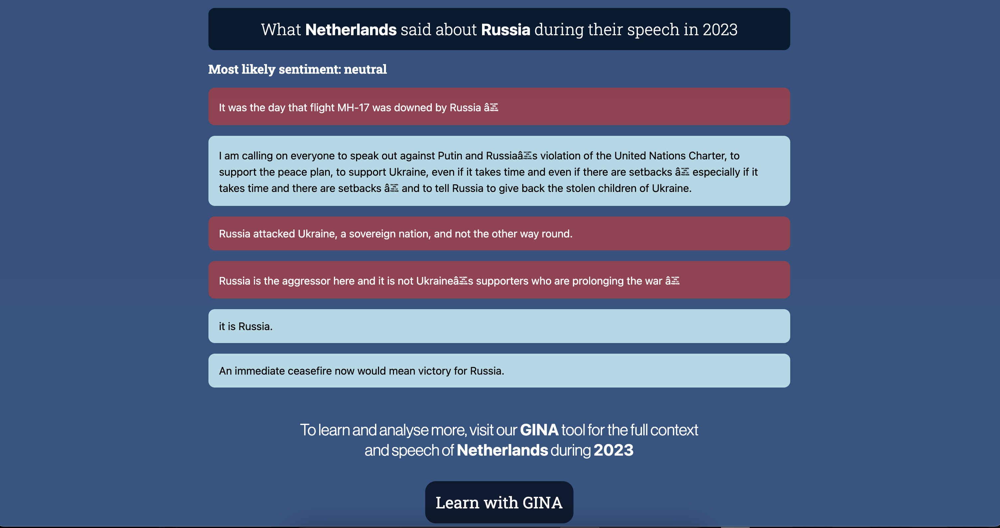

# 📊 Shifting Sentiments: Insights into the Russia-Ukraine Crisis


Over the course of six weeks, I collaborated with two visual designers to create a compelling data story focused on geopolitical conflict and sentiment analysis. The overarching goal of HCSS was to transform complex diplomatic data from GINA Diplomatic into interactive data stories that are intuitive, visually engaging, and user-friendly, while staying true to HCSS’s branding. However, our specific focus and research question were:

### "What is the sentiment within the United Nations General Assembly regarding Russia and Ukraine since the 2022 invasion?"

#  👨‍💻 Developing-method and framework

During the tech track of my Information Design minor, I was informed that SvelteKit is the best framework for the job due to its seamless integration with D3.js. The D3 library is perfect for creating custom charts and data visualizations.


# The GINA-Tool 

HCSS' <b>Geopolitical Interactive Network Analysis (GINA)</b> series stands as a pioneering suite of tools designed to transcend traditional analysis methods. By integrating diverse data from diplomatic, information, military, and economic spheres, GINA provides a multidimensional perspective on global relations that shape our world. 

##### (source: https://hcss.nl/gina/)

### 🥇 Our Goal

Based on GINA’s style and the results it generates, we aim to develop a visualization that offers a snapshot, designed to be easily interpretable at a glance. This serves as an introductory step for the user, offering immediate insights while guiding them to the more detailed version available on the HCSS website. It’s important to emphasize that this is <b>NOT</b> a replacement tool, but rather a complementary one, aimed at enhancing the user experience and encouraging deeper engagement with the full tool.

# 📊 The Data 

For this project, we received two datasets from our client, Jesse: the speeches JSON files from both 2022 and 2023, which contained speeches from various countries on both Russia and Ukraine, as well as other nations. While the data encompassed a broad range of topics, our visualization focused on the research question.

```json
{
    "speeches": [
        {
            "speaker_country": "Angola",
            "speech": "It is with great pleasure that I take the floor at the General Assembly...",
            "referenced_countries": [
                {
                    "country": "RUS",
                    "sentences": [
                        "As I did not attend the session of the General Assembly held in 2022.1 did not have an opportunity to express..."
                    ],
                    "sentiment": [
                        "negative",
                        "neutral"
                    ]
                },
                {
                    "country": "UA",
                    "sentences": [
                        "As I did not attend the session of the General Assembly held in 2022.1 did not have an opportunity to express, on behalf of Angola and Angolans..."
                    ],
                    "sentiment": [
                        "negative",
                        "negative",
                        "neutral"
                    ]
                }
            ]
        }
    ]
}

```


Additionally, we were able to download .csv files through the GINA tool from HCSS, which contained sentiment data regarding Russia and Ukraine. My goal was to combine these datasets in a complementary way, ensuring that the sentiment data from the speeches and the sentiment analysis from the GINA tool worked together to provide a cohesive and focused narrative on our research question.



# 🧬 The Speech Sphere 

The Speech-Sphere is our main interactive component that visualizes countries in a circular layout based on their participation in global events. After going through our datastory, where we explain the story's subjects like the conflict, mentions and sentiments. 


The focus is on displaying information related to countries’ sentiments in speeches, specifically about Russia and Ukraine, through the analysis of data from CSV and JSON files. Users can interact with this sphere to explore data about different countries’ sentiments and how they relate to the conflict.




## ⚙️ Features

| Feature                        | Description                                                                 |
| ------------------------------ | --------------------------------------------------------------------------- |
| Dynamic Seat Positions          | The countries are arranged in a circular layout, with seats placed based on several factors, including groups like G7, BRICS, and NATO. Each seat position is calculated dynamically using geometry. I created `countries.js`, where I created objects for the groups, id's, etc.   |
| Interactive Country Selection   | Users can select a country from a dropdown to highlight it on the sphere. When a country is selected, its sentiment data is displayed. The countries data can be found in the `countries.js` |
| Sentiment Display               | Each country seat reflects the sentiment associated with speeches (positive, negative, or neutral). Sentiment is displayed using different styles and colors. |
| Hover and Tooltip               | Hovering over a seat shows detailed information about the country, such as its name and flag, and the sentiment data from the selected year and conflict. |
| Comments and Analysis           | A comment box is available to show relevant data for the selected country, offering insights based on speeches about Russia or Ukraine. |
| Data from CSV and JSON Files    | The component pulls in data from external CSV files (for sentiment analysis of speeches) and JSON files (for speech analysis data). |
| Group Filters                   | Users can filter the countries by specific groups (G7, BRICS, NATO, etc.). The sphere will dynamically update to show the relevant countries within the selected group. |
| Responsive Design               | The layout adjusts based on screen size, ensuring that the sphere is displayed correctly on both large and small screens. |
| Country Flag and Information    | Each country’s flag is displayed in the center of its seat, providing a visual cue. Clicking a country seat displays more detailed data. |
| Smooth Scrolling                | The page features smooth scrolling when the user interacts with the component, making the browsing experience more fluid and responsive. |


# 💻  How install 

## Install Git (if not already installed)
	
  •	Go to the <a href="https://git-scm.com/downloads">Git website</a> and download the latest version of Git for your operating system.
	
  •	Follow the installation instructions to set up Git on your computer.

## Clone the repository 

•	Open your terminal (for macOS/Linux) or Command Prompt (for Windows).

•	Use the following Git command to clone the repository to your local machine. 

```bash
git clone https://github.com/AliAhmed205/HCSS-storytelling.git
```

•	This will create a local copy of the repository in a folder named `HCSS-storytelling.`

•	Go to the folder where the project was cloned

```bash
cd HCSS-storytelling
```

## Install Dependencies

•	install the required dependencies.

```bash
npm install
```

## Run the project

•	After installing the dependencies, you can start the project.

```bash
npm run dev -- --open
```

•	If everything is set up correctly, the application should be running locally on your computer. Open a web browser and go to http://localhost:(xxxx).


